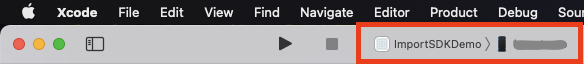
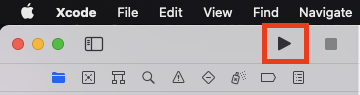

= Mandryl Drone App

== Getting Started

=== Initialize project

[source,shell]
----
./Hacks/project_init.sh
----

=== Test project

1. Open ImportSDKDemo.xcworkspace with XCode
2. Connect iPhone to your macOS PC with Wi-fi debug (ref. link:https://stackoverflow.com/questions/44382841/how-do-you-perform-wireless-debugging-in-xcode-9-with-ios-11-apple-tv-4k-etc[stackoverflow])
3. Choose your iPhone below + 

4. Build and run ImportSDKDemo + 

5. Connect iPhone to DJI drone with camera and GPS modules
6. Launch ImportSDKDemo app
7. Tap "Sign in" button and enter username and password +
** username: test-user
** password: passw0rd!
8. Back main page
9. Tap "Launch" button
10. After that, please refer to the following Project Media, "iOS Drone App Screen Record".
